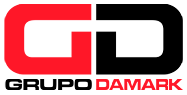

# Grupo Damark - Representante Oficial Canon para Venezuela

<p align="center">
  
</p>

---

## 📄 Descripción

**Grupo Damark** es una corporación líder en Venezuela con más de 20 años de trayectoria, especializada en la distribución de productos **CANON**. Nos proyectamos como una compañía experta en soluciones tecnológicas de impresión, copiado y servicios especializados a través de diversas unidades de negocio.

Este repositorio contiene el sitio web corporativo del grupo, diseñado para proporcionar información detallada sobre nuestras filiales y facilitar el contacto directo con nuestros clientes.

---

## 🏢 Unidades de Negocio

El ecosistema de Grupo Damark está compuesto por:

- **AVANCORP - DAMARK**: Mayoristas en productos de impresión, copiado y equipos Remarketing.
- **AVANSERVICES**: Soluciones de Outsourcing y renta de equipos multifuncionales.
- **PROIMCO TECH (TODOCANON)**: Venta y distribución de accesorios fotográficos y equipos Canon.
- **DATA SERVICE**: Servicios integrales de impresión y soluciones de copiado.
- **VISUAL MÉDICA**: Desarrollo de sistemas y software para diagnóstico por imágenes radiológicas.

---

## 🚀 Características del Proyecto

- **Diseño Responsive**: Adaptado a dispositivos móviles, tablets y escritorio mediante Bootstrap 5.
- **Navegación Single-Page**: Menú lateral dinámico con desplazamiento suave (smooth scroll).
- **Efectos Visuales**: Parallax scrolling y fondos de video optimizados.
- **Formulario de Contacto**: Integración con PHP para el envío de consultas.
- **Carruseles dinámicos**: Implementados con Slick Slider para una mejor visualización de contenidos.

---

## 🛠️ Tecnologías Usadas

El proyecto está construido con un stack moderno de tecnologías web front-end y back-end:

| Tecnología | Descripción |
| :--- | :--- |
| **PHP** | Lógica del servidor y manejo de formularios. |
| **HTML5 & CSS3** | Estructura y diseño visual avanzado. |
| **JavaScript / jQuery** | Interactividad y componentes dinámicos. |
| **Bootstrap 5** | Framework de diseño responsive. |
| **FontAwesome** | Librería de iconos vectoriales. |
| **Slick Slider** | Carruseles de imágenes y contenido. |
| **Parallax.js** | Efectos de profundidad en el desplazamiento. |

---

## 🔧 Instalación y Configuración Local

Para ejecutar este proyecto en tu entorno local (ej. XAMPP, WAMP o Laragon), sigue estos pasos:

1. **Clonar el repositorio:**
   ```bash
   git clone https://github.com/tu-usuario/grupodamark.git
   ```

2. **Mover a la carpeta del servidor:**
   Copia el contenido a la carpeta `htdocs` (XAMPP) o `www` (WAMP).

3. **Configurar el servidor de correo:**
   El archivo `send.php` utiliza la función `mail()` de PHP. Asegúrate de tener configurado un servidor SMTP en tu entorno local para probar el envío de correos, o despliégalo en un servidor de hosting real.

4. **Acceder vía navegador:**
   Ingresa a `http://localhost/grupodamark`.

---

## 📁 Estructura del Proyecto

```
grupodamark/
├── css/            # Estilos personalizados y librerías (Bootstrap, Slick)
├── fontawesome/    # Fuentes e iconos de FontAwesome
├── img/            # Recursos gráficos, logotipos y fondos
├── js/             # Scripts de interactividad y plugins
├── PHPMailer/      # Librerías auxiliares para envío de correos
├── video/          # Fondos de video para las secciones
├── index.php       # Página principal del sitio
├── send.php        # Manejador del formulario de contacto
└── README.md       # Documentación del proyecto
```

---

## ✉️ Contacto

- **Dirección**: 4TA. Transv de Monte Cristo, Edif. No. 11, Piso 1, Urbanización Monte Cristo, Caracas - Venezuela.
- **Teléfonos**: +58 212 2381141
- **Email**: [info@grupodamark.com](mailto:info@grupodamark.com)
- **Web**: [www.grupodamark.com](http://www.grupodamark.com)

---
<p align="center">Desarrollado con ❤️ para Grupo Damark</p>
